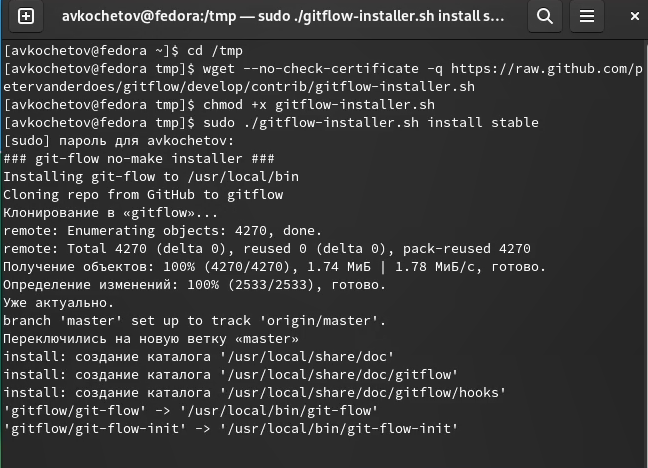
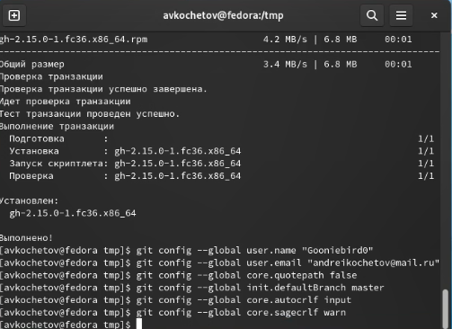
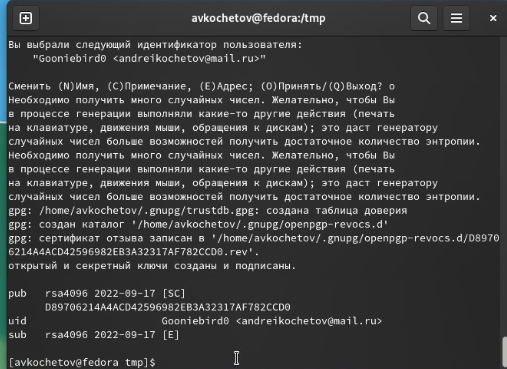
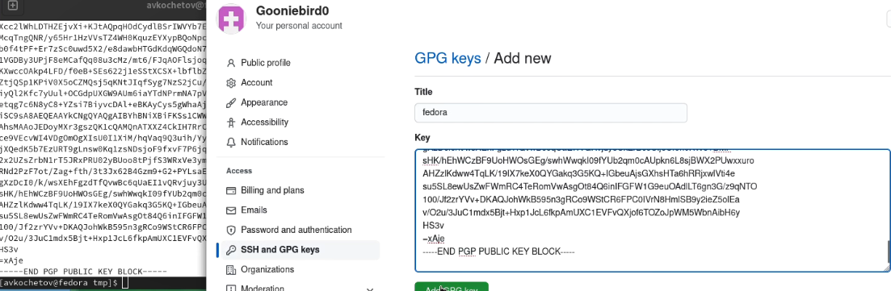
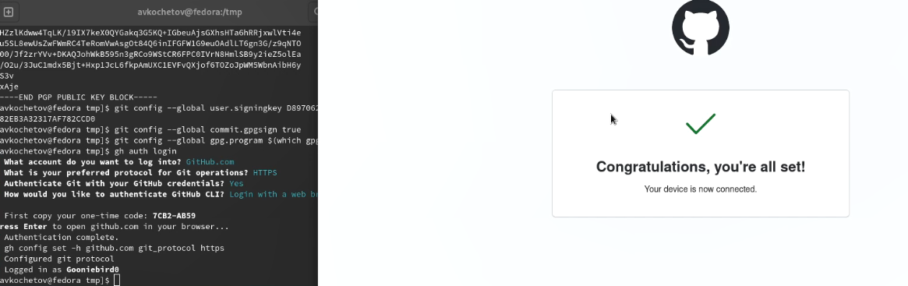
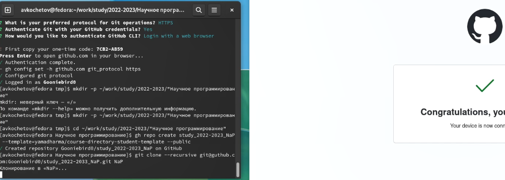

---
## Front matter
lang: ru-RU
title: Отчёт по лабораторной работе 3
author: 'Кочетов Андрей Владимирович'
date: 01 октября, 2022

## Formatting
toc: false
slide_level: 2
theme: metropolis
mainfont: PT Serif
romanfont: PT Serif
sansfont: PT Sans
monofont: PT Mono
header-includes: 
 - \metroset{progressbar=frametitle,sectionpage=progressbar,numbering=fraction}
 - '\makeatletter'
 - '\beamer@ignorenonframefalse'
 - '\makeatother'
aspectratio: 43
section-titles: true
---

## Цель работы

Изучение идеалогии и применение средств контроля версий. Освоение умения по работе с git. В рамках лабораторной работы 3 - создание отчета при помощи языка Markdown.

## Задание

Лабораторная работа подразумевает регистрацию на github, соединение его с виртуальной машиной и изучение основ. Создать отчет в Markdown.

# Выполнение лабораторной работы

1. Установил git-flow в Fedora Linux, а также gh (рис.1).

   { #fig:001 width=50% }

---

2. Задал базовые настройки git. Задал имя и email владельца репозитория, настроил utf-8 в выводе сообщений. Настроил верификацию и подписал коммиты git. Задал параметры autocrlf и safecrlf(рис.2).

   { #fig:002 width=60% }

---

3. Создал ключи ssh по разным алгоритмам rsa и ed. Также создал pgp ключ(рис.3).

   { #fig:003 width=60% }

---

4. Добавил ключ PGP ключ в настройки в github (рис.4).

   { #fig:004 width=60% }

---

5. Настроил автоматические подписи коммитов и связал между собой виртуальную машину и github (рис.5).

   { #fig:005 width=60% }

---

6. Создал репозитории по шаблону (рис.6).

   { #fig:006 width=60% }

---

7. Ознакомился с методичкой по Markdown (рис.7).

   { #fig:007 width=60% }

---

8. Оформленил отчет (рис.8).

   { #fig:008 width=60% }   

---

9. Создал отчеты в doc и pdf (рис.9).

   { #fig:009 width=60% }

---

# Выводы

Приобрел навыки работы с git, изучил основные функции, а также соединил его с виртуальной машиной. Создал отчет в Markdown, дал комментарии по файлу, а также скомпилировал отчет.

## {.standout}

Спасибо за внимание
