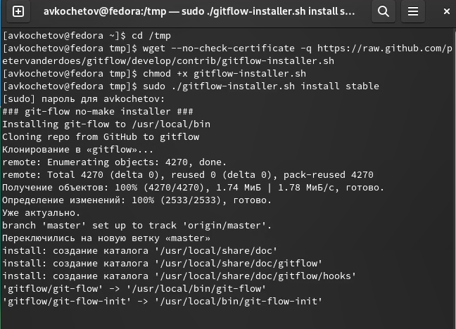
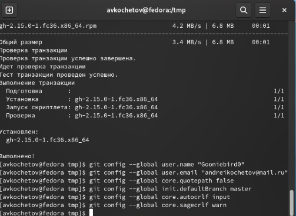
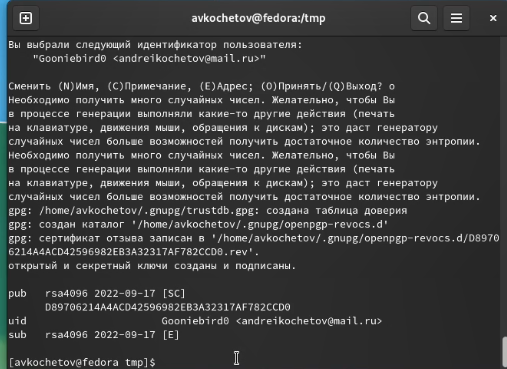
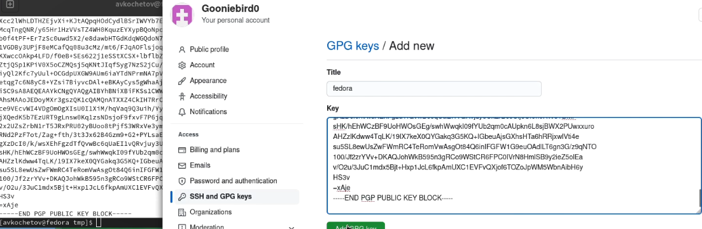
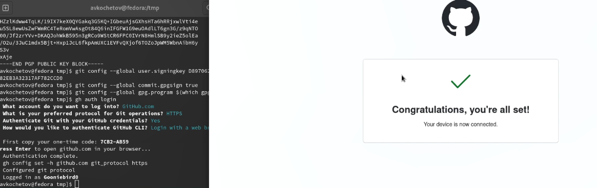
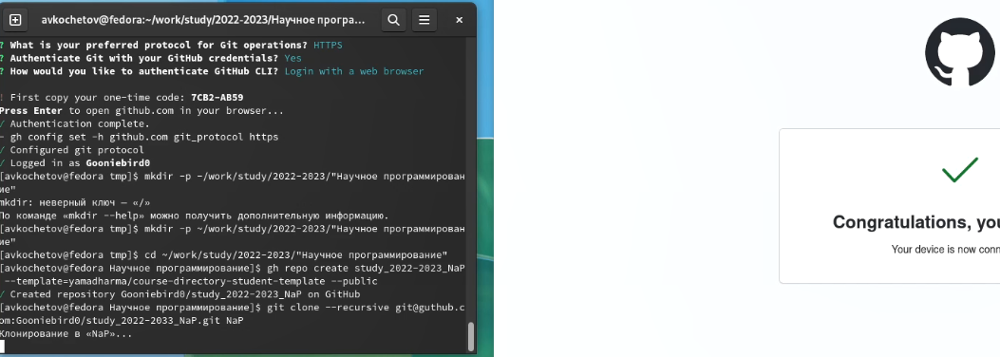

---
# Front matter
lang: ru-RU
title: 'Отчёт'
subtitle: 'по лабораторной работе 3'
author: 'Кочетов Андрей Владимирович'

# Formatting
toc-title: 'Содержание'
toc: true # Table of contents
toc_depth: 2
lof: true # List of figures
lot: true # List of tables
fontsize: 12pt
linestretch: 1.5
papersize: a4paper
documentclass: scrreprt
polyglossia-lang: russian
polyglossia-otherlangs: english
mainfont: LiberationSerif
romanfont: LiberationSerif
sansfont: LiberationSans
monofont: LiberationMono
mainfontoptions: Ligatures=TeX
romanfontoptions: Ligatures=TeX
sansfontoptions: Ligatures=TeX,Scale=MatchLowercase
monofontoptions: Scale=MatchLowercase
indent: true
pdf-engine: lualatex
header-includes:
  - \linepenalty=10 # the penalty added to the badness of each line within a paragraph (no associated penalty node) Increasing the value makes tex try to have fewer lines in the paragraph.
  - \interlinepenalty=0 # value of the penalty (node) added after each line of a paragraph.
  - \hyphenpenalty=50 # the penalty for line breaking at an automatically inserted hyphen
  - \exhyphenpenalty=50 # the penalty for line breaking at an explicit hyphen
  - \binoppenalty=700 # the penalty for breaking a line at a binary operator
  - \relpenalty=500 # the penalty for breaking a line at a relation
  - \clubpenalty=150 # extra penalty for breaking after first line of a paragraph
  - \widowpenalty=150 # extra penalty for breaking before last line of a paragraph
  - \displaywidowpenalty=50 # extra penalty for breaking before last line before a display math
  - \brokenpenalty=100 # extra penalty for page breaking after a hyphenated line
  - \predisplaypenalty=10000 # penalty for breaking before a display
  - \postdisplaypenalty=0 # penalty for breaking after a display
  - \floatingpenalty = 20000 # penalty for splitting an insertion (can only be split footnote in standard LaTeX)
  - \raggedbottom # or \flushbottom
  - \usepackage{float} # keep figures where there are in the text
  - \floatplacement{figure}{H} # keep figures where there are in the text
---

# Цель работы

Изучение идеалогии и применение средств контроля версий. Освоение умения по работе с git.
В рамках лабораторной работы 3 - создание отчета при помощи языка Markdown.

# Задание

Лабораторная работа подразумевает регистрацию на github, соединение его с виртуальной машиной и изучение основ.
Создать отчет в Markdown

# Выполнение лабораторной работы

1. Установил git-flow в Fedora Linux, а также gh (рис.1).

   { #fig:001 width=60% }

2. Задал базовые настройки git. Задал имя и email владельца репозитория, настроил utf-8 в выводе сообщений. Настроил верификацию и подписал коммиты git. Задал параметры autocrlf и safecrlf(рис.2).

   { #fig:002 width=60% }

3. Создал ключи ssh по разным алгоритмам rsa и ed. Также создал pgp ключ(рис.3).

   { #fig:003 width=60% }

4. Добавил ключ PGP ключ в настройки в github (рис.4).

   { #fig:004 width=60% }

5. Настроил автоматические подписи коммитов и связал между собой виртуальную машину и github (рис.5).

   { #fig:005 width=60% }

6. Создал репозитории по шаблону (рис.6).

   { #fig:006 width=60% }

7. Ознакомился с методичкой по Markdown (рис.7).

   { #fig:007 width=60% }

8. Оформленил отчет (рис.8).

   { #fig:008 width=60% }   

9. Создал отчеты в doc и pdf (рис.9).

   { #fig:009 width=60% }

# Выводы

Приобрел навыки работы с git, изучил основные функции, а также соединил его с виртуальной машиной.
Создал отчет в Markdown, дал комментарии по файлу, а также скомпилировал отчет.